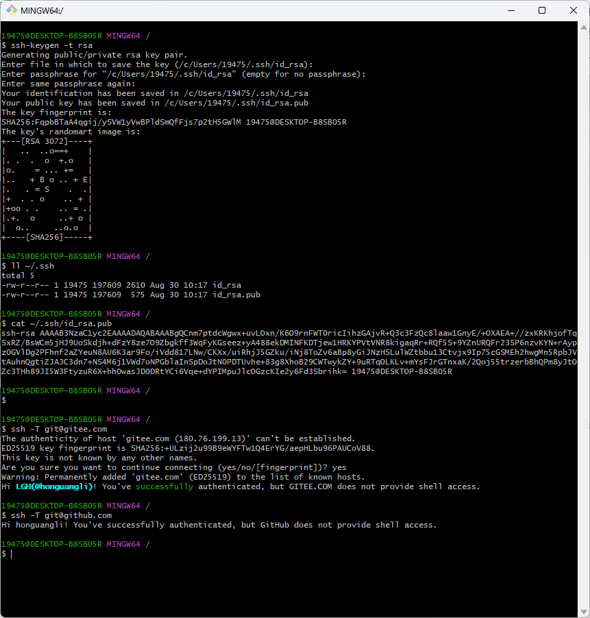
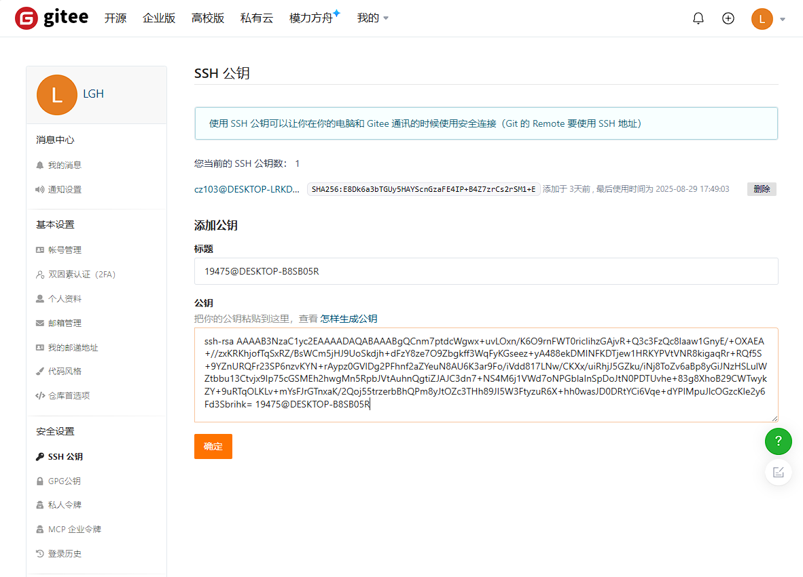
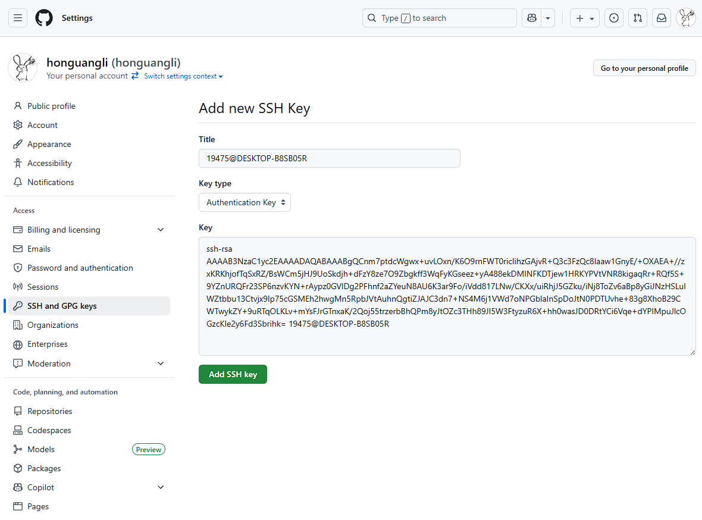

# Git

#### 安装教程

1. 下载  
   地址1：[https://git-scm.com/downloads/win](https://git-scm.com/downloads/win)  
   地址2：[https://git-scm.cn/downloads](https://git-scm.cn/downloads)
2. 配置
    ```bash
    git config --global user.name "username"
    git config --global user.email email
    ```

#### 使用说明

1.  查看配置
    ```bash
    git config --list --show-origin
    ```
2. 设置默认分支名称
    ```bash
    git config --global init.defaultBranch main
    ```
3. SSH配置

    1. 生成RSA秘钥
        ```bash
        ssh-keygen -t rsa
        ```
    2. 获取RSA公钥
        ```bash
        cat ~/.ssh/id_rsa.pub
        ```
    3. 验证公钥是否配置成功
        1. Gitee
            ```bash
            ssh -T git@gitee.com
            ```
        2. GitHub
            ```bash
            ssh -T git@github.com
            ```   

   

   

   